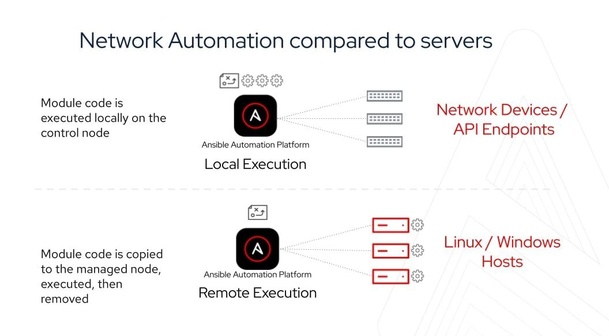

Learn the fundamentals of Ansible, powerful IT automation software that emphasizes simplicity and ease of use.

Ansible is an open source, command-line IT automation software application written in Python. It can configure systems, deploy software, and orchestrate advanced workflows to support application deployment, system updates, and more.

Ansible’s main strengths are simplicity and ease of use. It also has a strong focus on security and reliability, featuring minimal moving parts. It uses OpenSSH for transport (with other transports and pull modes as alternatives), and uses a human-readable language that is designed for getting started quickly without a lot of training.

**Comparing community Ansible with Red Hat Ansible Automation Platform?**
Visit the [Understanding Ansible, AWX, and Ansible Automation Platform](https://www.redhat.com/en/technologies/management/ansible/compare-awx-vs-ansible-automation-platform) to understand the differences.

# Community Ansible

The community distribution of Ansible contains a suite of powerful command line tools supported on most operating systems with Python installed.
This includes Red Hat Enterprise Linux, Debian, Ubuntu, MacOS, FreeBSD, Microsoft Windows, and more.
For more information on installing Ansible refer to the [installation documentation](https://docs.ansible.com/ansible/latest/installation_guide/intro_installation.html).

# Red Hat Ansible Automation Platform

Red Hat Ansible Automation Platform is a subscription product built on the foundations of Ansible with numerous enterprise features.
It combines more than a dozen upstream projects into an integrated, streamlined product. Each product component also has a specific purpose with a well-defined scope.
For example, the automation controller is the WebUI and API for Ansible automation, which is based on the upstream project AWX.
This component is bundled into the platform to manage automation.
Ansible Automation Platform is available to be run on-premise and charged by node (rather than by user), or you can use the managed service offering on Microsoft Azure.

# Efficient architecture

Both community Ansible and Ansible Automation Platform have the concept of a control node and a managed node.
The control node is where Ansible is executed from, for example where a user runs the ansible-playbook command.
Managed nodes are the devices being automated, for example a Microsoft Windows server.

For automating Linux and Windows, Ansible works by connecting to managed nodes and pushing out small programs, called "Ansible modules," to them.
These programs are written to be resource models of the desired state of the system.
Ansible then executes these modules (over SSH by default), and removes them when finished.
These modules are designed to be [idempotent](https://docs.ansible.com/ansible/latest/reference_appendices/glossary.html#term-Idempotency) when possible, so that they only make changes to a system when necessary.

For automating network devices and other IT appliances where modules cannot be executed, Ansible will run on the control node.
Since Ansible is agentless, it can still communicate with devices without requiring an application or service to be installed on the managed node.
To increase execution capacity for devices without the ability to run modules, Ansible Automation Platform can spread automation jobs out across execution nodes using a technology called [automation mesh](https://www.redhat.com/en/technologies/management/ansible/automation-mesh).
To understand more about how network automation is different, check out the [Ansible documentation](https://docs.ansible.com/ansible/latest/network/getting_started/network_differences.html).



For automating public clouds and web services, Ansible will also run modules locally and talk directly to their APIs.

# Credentials

For Ansible to execute, it needs an inventory (what are the managed nodes I am trying to automate?) and credentials (how do I login and connect to those managed nodes?).

Community Ansible is decentralized—meaning it relies on your existing OS credentials to control access to remote machines.
And if needed, Ansible can easily connect with Kerberos, Lightweight Directory Access Protocol (LDAP), and other centralized authentication management systems.
You can also just store usernames and passwords as variables for Ansible and encrypt them with [Ansible Vault](https://docs.ansible.com/ansible/latest/user_guide/vault.html).
This can be as easy as storing them in your inventory file, as elaborated on below.

Red Hat Ansible Automation Platform [can act as a centralized authentication](https://docs.ansible.com/automation-controller/latest/html/userguide/credentials.html) as well as integrate with industry-standard tools like CyberArk AIM, Conjur, HashiCorp Vault, and Microsoft Azure Key Vault.
Automation controller hashes local automation controller user passwords with the PBKDF2 algorithm using a SHA256 hash.
Users who authenticate via external account mechanisms (LDAP, SAML, OAuth, and others) do not have any password or secret stored.
For more information, check the [Secret handling and connection security](https://docs.ansible.com/automation-controller/latest/html/administration/secret_handling.html#ag-secret-handling) documentation.

# Manage your inventory in simple text files

By default, Ansible represents which machines it manages using a very simple INI file that puts all of your managed machines in groups of your own choosing.

To add new machines, there is no additional SSL signing server involved, so there's never any hassle deciding why a particular machine didn’t get linked up due to obscure NTP or DNS issues.

If there's another source of truth in your infrastructure, Ansible can also plug in to that, such as drawing inventory, group, and variable information from sources like Amazon Web Services, Google Compute Engine, Microsoft Azure, VMware vCenter, and more.
Both community Ansible and Ansible Automation Platform can use a variety of [dynamic inventory plugins](https://docs.ansible.com/ansible/latest/plugins/inventory.html).
Ansible Automation Platform makes these easily [available and configurable in the WebUI](https://docs.ansible.com/automation-controller/latest/html/userguide/inventories.html#inventory-plugins).

Here's what a plain text inventory file looks like:

```
[webservers]
www1.example.com
www2.example.com

[dbservers]
db0.example.com
db1.example.com
```

Once inventory hosts are listed, variables can be assigned to them in simple text files (in a subdirectory called 'group_vars/' or 'host_vars/') or directly in the inventory file.

Or, as already mentioned, you can use a dynamic inventory to pull your inventory from data sources like AWS and Azure.

# Playbooks: A simple and powerful automation language

Playbooks can finely orchestrate multiple slices of your IT infrastructure, with very detailed control over how many machines to tackle at a time.
This is where Ansible starts to get most interesting.

Ansible's approach to orchestration is one of finely tuned simplicity, as we believe you should be able to use existing knowledge while not having to remember special syntax or features.

Visit the ["Open Answers: What is patch management?"](https://youtu.be/VRoQLVHdNHE?si=Xc9hG0H9F0NjHpIs) video to hear Red Hat's Sean Cavanaugh explain things in more detail.

Here's what a playbook looks like.
As a reminder, this is only here as a teaser.
Visit [docs.ansible.com](https://docs.ansible.com/) for the complete documentation, and see all that's possible.

An example `apache.yml` playbook might look like:

```yaml
---
- name: Apache server installed
  hosts: web
  become: true
  tasks:

  - name: latest Apache version installed
    yum:
      name: httpd
      state: latest

  - name: Apache enabled and running
    service:
      name: httpd
      enabled: true
      state: started

  - name: copy index.html
    copy:
      src: web.html
      dest: /var/www/html/index.html
```

You can find the source for the preceding `apache.yml` in [this GitHub repository](https://github.com/ansible/workshops/blob/devel/exercises/ansible_rhel/1.3-playbook/apache.yml).

The Ansible documentation explores this in much greater depth.
There’s a LOT more that you can do, including:

* Take machines in and out of load balancers and monitoring windows.
* Have one server know the IP address of all the others, using facts gathered about those particular servers—and use those to dynamically build out configuration files.
* Set some variables and prompt for others, and set defaults for when they are not set.
* Use the result of one command to decide whether to run another.

There are lots of advanced possibilities, but it's [easy to get started](https://docs.ansible.com/ansible/latest/getting_started/index.html).

Most importantly, the language remains readable and transparent, and you never have to do things like declare explicit ordering relationships or write code in a programming language.

# Extend Ansible: plugins, modules, and API

Should you want to write your own, Ansible modules can be written in any language that can return JSON (Ruby, Python, Powershell, bash, etc).
Inventory can also plug in to any datasource by writing a program that speaks to that datasource and returns JSON.
There's also various Python APIs for extending Ansible’s connection types (SSH is not the only transport possible), callbacks (how Ansible logs, etc), and even for adding new server-side behaviors.

# The difference between Ansible community projects and Red Hat Ansible Automation Platform

Red Hat Ansible Automation Platform is a subscription product that builds upon the foundations of community Ansible and is designed to elevate automation across your organization.

Flexible, security-focused, and capable, Ansible Automation Platform helps IT teams create, manage, and scale automation in a standardized way.

With a subscription, you get fully supported and certified content from our robust partner ecosystem, expert knowledge gained from our success with thousands of customers, and differentiated services—like analytics reporting.

Here are three example instances of when Red Hat Ansible Automation Platform might make sense for an organization:

* Ansible Automation Platform can help organizations with security and support by providing [fully certified and signed content](https://www.redhat.com/en/technologies/management/ansible/automation-hub).
  Your organization can know which automation content is the official content, and digitally signed Ansible content collections ensure an end-to-end software supply chain from development to production.
* Ansible Automation Platform can help an organization with operationalizing automation at scale with [automation mesh](https://www.redhat.com/en/technologies/management/ansible/automation-mesh) and [automation execution environments](https://www.redhat.com/en/technologies/management/ansible/automation-execution-environments).
  Automation mesh allows an enterprise organization to add resilience, automation capacity, and security to their automation fabric across their IT infrastructure across multiple sites.
* Ansible Automation Platform can also help an organization understand their automation footprint with [automation analytics](https://www.redhat.com/en/technologies/management/ansible/automation-analytics-insights).
  Automation analytics helps IT leaders and automation architects observe how teams are adopting automation and track the success of those efforts.

To learn more about Red Hat Ansible Automation Platform, check out our knowledgebase article, [What is included in Red Hat Ansible Automation Platform subscription?](https://access.redhat.com/articles/6057451)

# Further reading

For additional reading, take a look at some of these e-books:

* [Red Hat Ansible Automation Platform: A beginner’s guide](https://www.redhat.com/en/engage/redhat-ansible-automation-20220412)
* [Automation at the edge: 7 industry use cases and examples](https://www.redhat.com/en/engage/automation-at-edge-20220727)
* [Network automation for everyone](https://www.redhat.com/en/engage/network-automation-everyone-s-202101221234)
* [Connect your hybrid cloud environment with IT automation](https://www.redhat.com/en/engage/hybrid-cloud-environment-20220412)
* [The cost of human error and the advantages of security automation](https://www.redhat.com/en/resources/cost-human-error-advantage-security-automation-ebook)
* [Simplify storage management](Simplify storage management)
